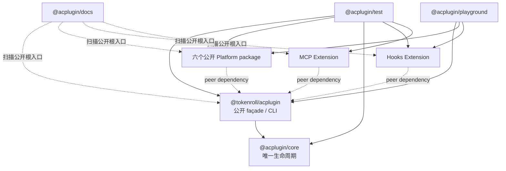
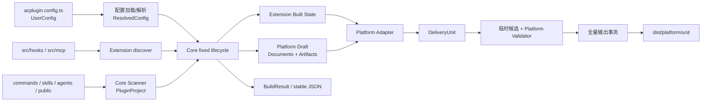

# ACPlugin 按 Package 代码导览

本文面向第一次进入 ACPlugin 1.0 代码库的维护者，按 workspace package 解释内容、架构、数据流和实现逻辑。它不是 API 规范的替代品；需要判断 MUST/MUST NOT 时，仍以正式规范、ADR 和源码为准。

建议先用 15 分钟读完“全局心智模型”和 `@acplugin/core`，再按当前任务跳到对应 package。代码链接指向主要入口，不要求从目录第一行顺序阅读。

## 1. Package 地图

| 目录 | Package | 发布状态 | 核心职责 |
| --- | --- | --- | --- |
| `packages/acplugin` | `@tokenroll/acplugin` | 公开 | 作者/第三方 SDK、CLI、配置加载、dev watch、init、隔离 Migration；不导出官方集成 |
| `packages/core` | `@acplugin/core` | 私有 | 类型与品牌、配置解析、Scanner、固定生命周期、owner 合并、兼容性、Artifact、事务和报告 |
| `packages/platforms/claude-code` | `@tokenroll/acplugin-platform-claude-code` | 公开 | Claude Code Plugin、可选 Marketplace、最终 Validator |
| `packages/platforms/codex` | `@tokenroll/acplugin-platform-codex` | 公开 | Codex Plugin、Skill 转换、可选 Marketplace、协议 Validator |
| `packages/platforms/cursor` | `@tokenroll/acplugin-platform-cursor` | 公开 | Cursor Plugin 与官方 Schema 子集校验 |
| `packages/platforms/antigravity` | `@tokenroll/acplugin-platform-antigravity` | 公开 | Antigravity Plugin 与 Skill fallback |
| `packages/platforms/opencode` | `@tokenroll/acplugin-platform-opencode` | 公开 | OpenCode Workspace Overlay |
| `packages/platforms/pi` | `@tokenroll/acplugin-platform-pi` | 公开 | Pi npm Package、Prompt/Skill 转换 |
| `packages/extensions/hooks` | `@tokenroll/acplugin-extension-hooks` | 公开 | Hook 作者协议、单次 Bundle、安全 Runner、六平台 Adapter |
| `packages/extensions/mcp` | `@tokenroll/acplugin-extension-mcp` | 公开 | HTTP/stdio MCP 作者协议、stdio Bundle/smoke、六平台 Adapter |
| `packages/test` | `@acplugin/test` | 私有 | 跨包、CLI、Migration、架构和发布边界集成测试 |
| `packages/docs` | `@acplugin/docs` | 私有 | VitePress 手写文档、九公开包 TypeDoc API 与导航生成 |
| `packages/playground` | `@acplugin/playground` | 私有 | 领域中立的全能力消费工程与 packaging/template smoke |

依赖方向是刻意收窄的：



- Core 不 import 任何具体 Platform、Hooks、MCP 或 Migration。
- 六个官方 Platform 和两个 Extension 的生产源码都只从主包导入公开 SDK，并把主包保持为 peer dependency；它们不能依赖私有 Core 或另一个集成。
- 主包通过 [tsdown 配置](../../packages/acplugin/tsdown.config.ts)只内联 Core。它没有官方集成 re-export、subpath 或 manifest 依赖，公开 tarball 运行时不出现 `@acplugin/*`。
- 每个 Platform 默认导出并具名导出自身工厂；MCP 的 Rolldown 重入口还被拆成独立 `bundler.mjs`。
- Docs 直接把九个公开 package 根目录作为 TypeDoc entry point，但不成为它们的运行时依赖；Playground 只通过公开包装配真实消费路径。

Migration 会在主包构建时把自验证所需的 Claude Code Platform 与 MCP Extension 代码内联进 CLI 的惰性 chunk，但不会给主包 manifest 增加官方集成运行时依赖，也不会让正常 façade/CLI 启动主动加载 Migration。

## 2. 全局心智模型

### 2.1 一次构建的数据流



唯一正式顺序是：

```text
configResolved
→ buildStart
→ Extension.discover
→ Scanner
→ Extension.validate/build
→ Platform.prepare
→ Adapter.apply
→ Platform.generateBundle/validateBundle
→ generateDistributions
→ compatibility propagation
→ transaction
→ buildEnd（按初始化逆序）
```

CLI 和程序化 `runProject()` 最终都进入 [`executeLifecycle()`](../../packages/core/src/lifecycle.ts)，没有第二条构建路径。

### 2.2 关键数据对象如何接力

| 数据对象 | 产生者 | 消费者 | 重要性质 |
| --- | --- | --- | --- |
| `UserConfig` | `acplugin.config.ts` | 主包配置加载器、Core `resolveConfig()` | 作者输入；可以是对象或函数 |
| `ResolvedConfig` | Core config | Core lifecycle | 绝对路径化、默认值合并、Platform/Extension 已品牌校验 |
| `PluginProject` | Core Scanner | Extension validate/build、Platform、Adapter | Commands/Skills/Agents/Public 的唯一规范模型，深度冻结 |
| `Discovered*` | Extension discover | 同一 Extension validate/build | 作者格式的已加载描述，不跨 Extension 暴露 |
| `Built*` | Extension build | 同一 Extension 的 Platform Adapter | 平台中立状态；可引用 Extension 独占 workDir |
| `DraftDocument` | Platform prepare | Adapter、Platform generateBundle | Platform 拥有，Extension 只能向声明的空 extension point add-only patch |
| `ArtifactInput` | Platform/Adapter/Public | Artifact Registry | `bytes` 或普通文件来源；尚未带 hash/owner |
| `Artifact` | Core Artifact Registry | DeliveryUnit、事务、报告 | 已绑定 owner、mode、size、SHA-256，且来源授权已验证 |
| `DeliveryUnit` | Platform + Core Registry | Validator、事务 | 主 Plugin/Workspace/Package 或 Marketplace Distribution |
| `BuildResult` | Core reports | CLI、程序化 API、JSON 输出 | 稳定排序、无内容字节、无绝对路径、无 Secret 值 |

数据不会反向穿透边界：Platform 看不到另一个 Platform 的 workDir；Extension 看不到另一个 Extension 的 Built State；Validator 只能观察自己临时物化的候选；报告不携带 Artifact 内容、原始异常、临时路径或环境变量值。

### 2.3 三个最重要的不变量

1. **Core 决定流程，Platform 决定格式。** Core 不写平台名称分支；Platform 不直接提交 `dist`。
2. **所有贡献都有 owner。** Document 归 `platform:<id>`，Adapter Artifact 归 `extension:<name>`，Public 归 `public`；owner 决定允许读取的文件来源。
3. **先完整验证，再整体交换。** 任一 Platform、Extension、Validator 或 `buildEnd` 失败，不能留下部分新输出。

Extension Adapter 按 `extensions[]` 配置顺序串行运行。`getDocument()` 能看到前序贡献，因此顺序有语义；add-only 只能防止替换和静默合并，不能保证 Adapter 可交换。同一扩展点或输出路径的冲突必须失败。

## 3. `@tokenroll/acplugin`：公开 façade、CLI 与工程入口

### 3.1 从哪里开始读

- [src/index.ts](../../packages/acplugin/src/index.ts)：精选公开 SDK、`defineConfig()` 与 `runProject()`；没有官方集成导出。
- [src/project-config.ts](../../packages/acplugin/src/project-config.ts)：Jiti 加载配置、运行时 Schema 检查、配置依赖监听。
- [src/run-project.ts](../../packages/acplugin/src/run-project.ts)：CLI/程序化 API 到 Core 生命周期的唯一桥。
- [src/cli.ts](../../packages/acplugin/src/cli.ts)：Commander 命令、报告、退出码、dev watcher。
- [src/init.ts](../../packages/acplugin/src/init.ts)：新工程脚手架。
- [src/migration/index.ts](../../packages/acplugin/src/migration/index.ts)：隔离的 legacy 输入迁移。
- [tsdown.config.ts](../../packages/acplugin/tsdown.config.ts)：内联 Core、库/CLI 入口和 Migration lazy chunk 边界。

### 3.2 内容与架构

主包是“装配层”，不重新实现 Core 规则：

- `index.ts` 公开作者和第三方集成需要的生命周期类型、`definePlatform()`、`defineExtension()`、Artifact helper 和稳定序列化函数；Registry、事务实现和官方工厂不从 façade 泄漏。
- `project-config.ts` 使用每次运行无缓存的 Jiti 执行可信 TypeScript 配置，并记录 Jiti 实际转换的配置 import、Extension descriptor 和外部 package root，供 dev 监听。
- `run-project.ts` 处理 CLI 的 Platform 子集和 strict 覆盖，然后调用 Core。
- `cli.ts` 将 `validate`、`inspect`、`build`、`dev` 映射到同一入口；`init` 是脚手架；`migrate` 使用动态 import 保持 Migration 隔离。
- 主包构建产生库入口和可执行 CLI；Migration 保留为 CLI 才能触达的独立 chunk。主包没有 Platform subpath。

### 3.3 数据流

```text
argv / RunProjectOptions
→ loadProjectConfig()
→ Jiti 执行 UserConfig
→ Core resolveConfig(require non-empty branded platforms)
→ 可选 Platform/strict 运行时覆盖
→ executeLifecycle()
→ BuildResult
→ CLI 文本、stable JSON 或程序化返回值
```

`executeProject()` 还额外返回 `projectRoot`、`outDir`、`watchPaths` 和 `dependencyRoots`，但这些绝对路径只给内部 dev watcher，不进入公开 `BuildResult`。

`--platform <id...>` 只筛选配置中已经实例化的平台，不按 ID import 或安装 package。Claude Code/Codex 的“默认”只存在于 `init` 的脚手架选择：生成结果仍包含显式依赖、import 和 `platforms` 数组。

### 3.4 实现伪代码

```ts
async function runProject(options) {
  loaded = await loadProjectConfigWithFreshJiti(options)
  config = applyConfiguredPlatformSubsetAndStrictOverride(loaded.config, options)

  result = await Core.executeLifecycle({
    config,
    commit: commandIsBuildOrDev && options.commit !== false,
    loadTypeScriptModule: loaded.sharedJitiLoader,
    onWatchFile: rememberExtensionBundleDependency,
  })

  return result
}
```

dev 的重点不是缓存产物，而是可靠地重跑完整事务并保留最后成功输出：

```ts
watchPaths = configEntry + projectRoot + descriptors + bundleModuleGraph
startChokidar(ignoreManagedOutDir)
await compensatingBuildAfterWatcherReady()

onAnyChange:
  debounce()
  mergeChangesWhileBuildIsRunning()
  result = await executeProject({ command: 'dev', commit: true })
  replaceWatchSetIfDependencyGraphChanged()
  // 构建失败时 Core 不替换旧 dist
```

### 3.5 Init 与 Migration 的边界

`initializeProject()` 只写最小规范工程：配置、package manifest、示例源目录和可选 Extension 空目录。它拒绝符号链接、非空目标和非法名称，不会生成伪 Hook/MCP 实现。

Migration 是同一个 package 内的隔离子系统，但不属于正常构建：

```ts
CLI migrate
→ dynamic import('./migration/index.js')
→ 容错扫描 legacy Claude project/plugin
→ 先稳定分配 canonical ID
→ 安全可映射内容写入临时 canonical project
→ 不可映射内容写 .acplugin-migration/unmapped
→ 用正式配置加载与生命周期验证生成结果
→ 非 dry-run 时提交到全新目标目录
```

修改正常构建时不要 import `migration/`；修改 legacy 容错逻辑时也不要把宽松类型和旧概念带回 Core。

## 4. `@acplugin/core`：唯一编排器与安全边界

### 4.1 模块分工

| 文件 | 负责什么 |
| --- | --- |
| [contracts.ts](../../packages/core/src/contracts.ts) | Platform/Extension/Adapter 生命周期接口、符号品牌、Document/DeliveryUnit 契约 |
| [types.ts](../../packages/core/src/types.ts) | Config、Component、PluginProject、Artifact、BuildResult 数据类型 |
| [config.ts](../../packages/core/src/config.ts) | 顶层 Schema、路径解析、默认值、Platform/Extension 配置校验 |
| [scanner.ts](../../packages/core/src/scanner.ts) | Markdown/frontmatter、Skill 辅助文件、Public、依赖图和平台字段扫描 |
| [lifecycle.ts](../../packages/core/src/lifecycle.ts) | 唯一固定阶段顺序、隔离 workDir、失败收敛、全局提交门槛 |
| [documents.ts](../../packages/core/src/documents.ts) | owner-aware add-only Document Registry 和 Platform Draft |
| [artifacts.ts](../../packages/core/src/artifacts.ts) | Artifact 路径、来源授权、普通文件、mode、size、hash |
| [output-paths.ts](../../packages/core/src/output-paths.ts) | 绝对/父目录路径拒绝、大小写与 Unicode 规范化冲突 |
| [delivery-units.ts](../../packages/core/src/delivery-units.ts) | 全局 Platform/Unit 唯一性和继承 Artifact 完整性 |
| [diagnostics.ts](../../packages/core/src/diagnostics.ts) | 诊断、兼容性、元数据去向、严格度和依赖传播 |
| [transaction.ts](../../packages/core/src/transaction.ts) | 候选物化、完整性复核、锁、恢复、stage/backup/swap/rollback |
| [serialization.ts](../../packages/core/src/serialization.ts) | 稳定 JSON/YAML/frontmatter 序列化 |
| [reports.ts](../../packages/core/src/reports.ts) | 构造、排序、脱敏和序列化 `BuildResult` |

### 4.2 Core 的内部架构

Core 把“插件系统”拆成四类 Registry/Collector：

- `DocumentRegistry`：管理结构化文档和值级 owner。
- `ArtifactRegistry`：管理物理路径、来源授权和内容摘要。
- `DeliveryUnitRegistry`：管理最终交付单元及继承 Artifact。
- Diagnostic/Compatibility/Metadata Collector：管理可报告的结构化结论。

这些对象由 `executeLifecycle()` 统一创建，Platform 和 Extension 只能拿到最小回调，不能持有 Registry 本体。

### 4.3 主生命周期伪代码

```ts
async function executeLifecycle(request) {
  runtimeRoot = makeTemporaryRoot()
  diagnostics = new DiagnosticCollector(redact(projectRoot, runtimeRoot))
  platformRuntimes = makeIsolatedWorkDirs(config.platforms)
  extensionRuntimes = makeIsolatedWorkDirs(config.extensions)

  try {
    await configResolved(platformsThenExtensionsInConfigOrder)
    await buildStart(platformsThenExtensionsInConfigOrder)

    discovered = await eachExtension.discover()
    project = await scanProject(config)
    sourcePolicies = deriveExactOwnerAuthorizations(project, workDirs)

    await eachExtension.validate(discovered, project)
    built = await eachExtension.build(discovered, project)

    for (platform of configuredPlatforms) {
      draft = PlatformDraftRegistry.create(await platform.prepare(project))
      draft.injectPublicArtifacts(project.publicFiles)

      for (extension of configuredExtensionsWithResources) {
        adapter = extension.adapterFor(platform.id)
        if (!adapter) reportUnsupported()
        else await adapter.apply(restrictedDraftContext, extension.built)
      }

      applyCompatibilityStrictness()
      primaryInput = await platform.generateBundle(draft.snapshot())
      assertAllInheritedDocumentsAndArtifactsWerePreserved(primaryInput)

      primary = await deliveryUnits.add(primaryInput)
      await materializeValidateAndRecheck(primary, platform.validateBundle)

      distributions = await platform.generateDistributions?.([primary])
      await validateEachDistribution(distributions)
    }

    propagateComponentDependencyCompatibility()
    if (allPlatformsSucceeded && noErrors) {
      if (commitRequested)
        await commitAllUnitsAtomically({ afterSwap: reverseBuildEnd })
      else
        await validateWholeTreeWithoutCommit()
    }
  } catch (unknownError) {
    addStableInternalDiagnosticWithoutLeakingRawError()
  } finally {
    await reverseBuildEndForAnythingNotFinalized()
    removeTemporaryRoot()
  }

  return stableBuildResult()
}
```

### 4.4 Document 合并逻辑

Platform 在 `prepare()` 声明初始值和允许的 `extensionPoints`。Adapter 不能 deep merge 任意对象，只能向一个精确、当前为空、尚未被其他 owner 占用的路径添加值。

```ts
function patchDocument(extensionOwner, patch) {
  document = requirePlatformDocument(patch.document)
  requirePathWasDeclaredAsExtensionPoint(patch.path)
  requireNoParentOrChildExtensionPointAmbiguity(patch.path)
  requireFieldIsEmpty(document.value, patch.path)
  requireNoExistingOwner(patch.path)

  cloned = cloneAndFreezeFiniteJson(patch.value)
  document.value = addFieldWithoutReplacing(document.value, patch.path, cloned)
  fieldOwners.set(patch.path, extensionOwner)
}
```

如果 patch 或 Artifact 贡献被拒绝，即使第三方 Adapter 捕获同步异常，Core 仍记录粘滞失败并阻止当前 Platform 提交。

### 4.5 Artifact 来源与输出事务

文件型 Artifact 不是“给一个路径就复制”。Core 根据 owner 建立授权：

- `platform:<id>`：自己的 workDir，加 Scanner 精确发现的 Component/Skill 文件。
- `extension:<name>`：只有自己的 workDir。
- `public`：只有 Scanner 精确发现的 Public 文件。

事务伪代码：

```ts
lock = acquireExclusiveLock(outDir)
recoverStaleBackupTransactionAndStage()
stage = createSiblingStage(outDir) // 保证同一文件系统 rename
materializeAllDeliveryUnits(stage)
reReadAndVerifyTypeHashSizeMode(stage)
writeTransactionRecord()

rename(oldOutDir, backup)
try {
  rename(stage, outDir)
  await afterSwapBuildEnd()
  removeTransactionAndBackupBestEffort()
} catch (error) {
  removeNewOutDir()
  rename(backup, outDir)
  throw error
} finally {
  removeStageAndLockBestEffort()
}
```

因此修改事务代码时，正常成功测试远远不够，必须覆盖每个 phase 的故障注入、崩溃恢复和回滚失败。

## 5. 六个公开 Platform package 的共同模板

六个平台的 [src/index.ts](../../packages/platforms/claude-code/src/index.ts) 都从 `@tokenroll/acplugin` 使用公开 `definePlatform()`，由同一主包 peer 实例注入模块私有 Symbol 品牌，并实现同一模板：

```ts
function platformFactory(options) {
  validatePlatformOptions(options)
  return definePlatform({
    id,
    apiVersion: '1',
    deliveryType,
    validateComponentFields,
    prepare: project => ({ documents: platformOwnedDocuments, artifacts: [] }),
    generateBundle: mergedDraft => ({
      id: deliveryType,
      role: 'primary',
      type: deliveryType,
      artifacts: inherited + convertedComponents + serializedDocuments,
    }),
    validateBundle: validateMaterializedPlatformCandidate,
    generateDistributions: optionalMarketplace,
  })
}
```

每个 Platform package 自己拥有四件事：Component 转换、结构化 Document/Manifest、DeliveryUnit 形态、最终候选 Validator。新增平台格式判断不应写到 Core 或主包 CLI。

## 6. `@tokenroll/acplugin-platform-claude-code`

### 内容与数据流

- [components.ts](../../packages/platforms/claude-code/src/components.ts)：Command、Skill、Agent 都生成 Claude Code 原生资源；规范能力映射为工具，抽象模型档位映射为稳定别名。
- [manifest.ts](../../packages/platforms/claude-code/src/manifest.ts)：拥有 `.claude-plugin/plugin.json`，开放 `hooks`、`mcpServers` 两个 add-only 点，并可组合 Marketplace。
- [validator.ts](../../packages/platforms/claude-code/src/validator.ts)：重新读取物化候选，验证 manifest、hooks、MCP 引用、Marketplace 和路径边界。
- [types.ts](../../packages/platforms/claude-code/src/types.ts)：Marketplace owner、元数据和平台选项。

```text
PluginProject
→ commands/<id>.md
→ skills/<id>/SKILL.md + auxiliary files
→ agents/<id>.md
→ .claude-plugin/plugin.json
→ Hooks/MCP Adapter 可追加配置与运行文件
→ plugin DeliveryUnit
→ 可选 marketplace DeliveryUnit
```

### 实现伪代码

```ts
prepare(project):
  manifest = createClaudePluginManifest(project.metadata)
  expose extensionPoints ['hooks'] and ['mcpServers']

generateBundle(draft):
  commands = mapArguments('{{arguments}}' -> '$ARGUMENTS')
  skills = copyCanonicalSkillsAndAuxiliaryFiles()
  agents = mapCapabilitiesToClaudeToolsAndModelAliases()
  return plugin(draft.artifacts + commands + skills + agents + stableManifest)

generateDistributions(primary):
  if no marketplace option return []
  composeValidatedPrimaryPluginIntoMarketplace(primary)
```

优先读 `components.ts` 来改转换，读 `manifest.ts` 来改清单字段，读 `validator.ts` 来改最终平台约束；三处通常需要同步测试。

## 7. `@tokenroll/acplugin-platform-codex`

### 内容与数据流

- [components.ts](../../packages/platforms/codex/src/components.ts)：原生 Skill；Command 转 `command-<id>` Skill；Agent 降级为 `agent-<id>` 指导 Skill；可生成 `agents/openai.yaml`。
- [manifest.ts](../../packages/platforms/codex/src/manifest.ts)：拥有 Codex Plugin manifest、Hooks/MCP 扩展点和可选 Marketplace。
- [protocol.ts](../../packages/platforms/codex/src/protocol.ts)：类别、安装方式、界面字段、URL/资源路径和 SVG 尺寸协议。
- [validator.ts](../../packages/platforms/codex/src/validator.ts)：验证 Skill、展示资源、Hook、MCP、Plugin 和 Marketplace 的引用闭包。

Command 中的 `{{arguments}}` 会变成显式调用指引，并独立报告 `arguments/transform`；`argumentHint` 因没有等价 UI 仍单独降级。fallback ID 会在 `prepare()` 前检查大小写不敏感冲突。

### 实现伪代码

```ts
prepare(project):
  rejectCollisions(skillId, `command-${id}`, `agent-${id}`)
  manifest = createCodexManifest(interfaceOptions)
  expose ['hooks'] and ['mcpServers']

generateBundle(draft):
  nativeSkills = emitSkills(project.skills)
  commandSkills = emitExplicitSkills(project.commands, prefix='command-')
  agentSkills = emitGuidanceSkills(project.agents, prefix='agent-')
  metadata = emitOptionalAgentsOpenAiYaml()
  reportNativeTransformOrDegradedPerCapability()
  return plugin(draft.artifacts + allSkills + metadata + stableManifest)
```

Codex Validator 最复杂。改 manifest/interface/Skill metadata 时，要同时检查 `protocol.ts`、生成器、Validator、golden 和跨包测试，不能只改序列化输出。

## 8. `@tokenroll/acplugin-platform-cursor`

### 内容与数据流

- [components.ts](../../packages/platforms/cursor/src/components.ts)：三类 Component 都生成 Cursor 原生文件；Command 参数占位符变为 `$ARGUMENTS`；只读能力可精确映射为 `readonly`。
- [manifest.ts](../../packages/platforms/cursor/src/manifest.ts)：拥有 `.cursor-plugin/plugin.json`，只声明工程实际存在的资源 glob，开放 `hooks`、`mcpServers`。
- [validator.ts](../../packages/platforms/cursor/src/validator.ts)：固定 Schema 子集、资源引用、logo URL/文件和路径安全。

### 实现伪代码

```ts
prepare(project):
  manifest = {
    identityMetadata,
    commands: project.hasCommands ? './commands/*.md' : omitted,
    skills: project.hasSkills ? './skills/*/SKILL.md' : omitted,
    agents: project.hasAgents ? './agents/*.md' : omitted,
  }
  expose ['hooks'] and ['mcpServers']

generateBundle(draft):
  emitNativeCommandsSkillsAgents()
  reportModelOrCapabilityLossesPrecisely()
  return plugin(draft.artifacts + components + manifest)
```

Cursor 的“原生”只表示资源形态原生，不代表每个规范字段都无损；模型档位和非只读能力组合仍通过字段级兼容性报告表达。

## 9. `@tokenroll/acplugin-platform-antigravity`

### 内容与数据流

- [components.ts](../../packages/platforms/antigravity/src/components.ts)：Skill 原生；Command 转 `command-<id>` Skill；Agent 转 `agent-<id>` 指导 Skill。
- [manifest.ts](../../packages/platforms/antigravity/src/manifest.ts)：只生成已确认的最小 `plugin.json`，没有 Document extension point。
- [validator.ts](../../packages/platforms/antigravity/src/validator.ts)：校验最小 manifest/schema 和根结构。

Hooks 和 MCP 仍可通过 Adapter 贡献独立的 `hooks.json`、`mcp_config.json` 与运行文件，但不能 patch `plugin.json`。

### 实现伪代码

```ts
prepare(project):
  rejectCollisions(skillId, `command-${id}`, `agent-${id}`)
  return minimalPluginJson(withNoExtensionPoints)

generateBundle(draft):
  emitNativeSkills()
  emitCommandFallbackSkills()
  emitAgentGuidanceSkills()
  appendAdapterArtifactsWithoutManifestMutation()
  return plugin(allArtifacts + pluginJson)
```

这里的设计倾向是“字段少但可信”。未经官方契约确认的 manifest 字段不应为了看起来完整而加入。

## 10. `@tokenroll/acplugin-platform-opencode`

### 内容与数据流

- [components.ts](../../packages/platforms/opencode/src/components.ts)：生成 `.opencode/commands`、`.opencode/skills`、`.opencode/agents`；Agent 能力转换为 tools/permissions。
- [config-document.ts](../../packages/platforms/opencode/src/config-document.ts)：拥有可 `omit-if-empty` 的 `opencode.json`，只开放 `mcp` 扩展点。
- [validator.ts](../../packages/platforms/opencode/src/validator.ts)：确保交付是 Workspace Overlay，不伪造通用 package 或 Plugin manifest。

Hooks Adapter 通过 `.opencode/plugins/acplugin-hooks.mjs` 提供 runtime Plugin，不需要修改 `opencode.json`；MCP Adapter 则 patch `workspace-config.mcp`。

### 实现伪代码

```ts
prepare(project):
  workspaceConfig = options.workspace ?? {}
  expose ['mcp']
  mark opencodeJson as omitIfEmpty

generateBundle(draft):
  commands = emitWorkspaceCommands()
  skills = emitWorkspaceSkills()
  agents = emitSubagentsWithToolsAndPermissions()
  config = serializeOnlyIfNonEmptyAfterMcpPatch()
  return workspace(draft.artifacts + commands + skills + agents + config)
```

不要为 OpenCode 添加普通 `package.json` 来模拟安装包；它的主交付单元类型就是 `workspace`。

## 11. `@tokenroll/acplugin-platform-pi`

### 内容与数据流

- [components.ts](../../packages/platforms/pi/src/components.ts)：Command 转 `prompts/<id>.md`；Skill 原生；Agent 转 `agent-<id>` 指导 Skill。
- [manifest.ts](../../packages/platforms/pi/src/manifest.ts)：拥有真实 npm `package.json`，开放 `pi.extensions` 给 Hooks Adapter。
- [validator.ts](../../packages/platforms/pi/src/validator.ts)：验证 Pi discovery 路径、package 边界，并拒绝 workspace/private 运行时泄漏。

Pi 没有首期 MCP 配置，MCP Adapter 只报告 unsupported，不生成隐式客户端。

### 实现伪代码

```ts
prepare(project):
  rejectCollisions(skillId, `agent-${id}`)
  packageJson = createPublishablePiPackageManifest(options.package)
  expose ['pi', 'extensions']

generateBundle(draft):
  prompts = transformCommandsToPromptTemplates('$ARGUMENTS')
  skills = emitNativeSkills()
  agentSkills = emitGuidanceFallbacks()
  return package(draft.artifacts + prompts + skills + agentSkills + packageJson)
```

改 Pi package manifest 时要同时考虑 npm 合法性、Pi discovery 和公开 tarball 字段，不能照搬 workspace 根 manifest。

## 12. `@tokenroll/acplugin-extension-hooks`

### 12.1 内容与架构

- [types.ts](../../packages/extensions/hooks/src/types.ts)：`defineHook()` 品牌、规范事件、事件级输入/结果类型、平台选项。
- [discovery.ts](../../packages/extensions/hooks/src/discovery.ts)：扫描 `src/hooks/<id>/hook.ts`、加载品牌定义、校验事件和字段。
- [bundler.ts](../../packages/extensions/hooks/src/bundler.ts)：每个 Hook 只 Bundle 一次，登记真实模块图并收集第三方许可证。
- [runtime-source.ts](../../packages/extensions/hooks/src/runtime-source.ts)：生成平台中立安全 Handler，限制输入输出和 JSON 深度，拦截作者 stdout/stderr/exit。
- [wire-source.ts](../../packages/extensions/hooks/src/wire-source.ts)：由 Adapter 生成平台协议 wire，负责 stdin/stdout 与 camelCase/规范结果映射。
- [adapters.ts](../../packages/extensions/hooks/src/adapters.ts)：六个平台事件矩阵、Artifact 布局、Document patch 和兼容性报告。

作者只实现语义函数：

```ts
export default defineHook({
  event: 'PreToolUse',
  async run(input, context) {
    return { decision: 'allow', updatedInput: input.toolInput }
  },
})
```

作者不能提交 shell 命令、原始平台 Handler、HTTP 回调或任意 stdout 协议。

### 12.2 数据流

```text
src/hooks/<id>/hook.ts
→ DiscoveredHook { id, sourcePath, branded definition }
→ validate event/matcher/timeout/platform options
→ BundledHook { definition, handler.mjs, optional licenses }
→ BuiltHooks（按 ID 稳定顺序）
→ 当前 Platform Adapter
→ handler.mjs + wire.mjs + 平台 Hook 配置
→ Document patch（仅需要 manifest 引用的平台）
```

同一个平台中立 `handler.mjs` 被多个 Adapter 复用；每个平台贡献相邻 `wire.mjs`。这样作者逻辑不会为六个平台重复 Bundle，平台 stdin/stdout 协议也不会污染作者 API。

### 12.3 实现伪代码

```ts
function hooks(options) {
  return defineExtension({
    discover: scanAndLoadBrandedHookDescriptors,
    validate: validateCanonicalEventsAndConfiguredPlatformFields,
    build: async discovered => {
      for (hook of discovered.sortedHooks) {
        runner = generateBoundedSemanticRunner(hook)
        chunk = rolldownOneNode20EsmChunk(runner)
        rejectNativeAddonsAndUnexpectedAssets(chunk)
        collectThirdPartyLicenses(chunk)
      }
      return freezeBuiltHooks()
    },
    adapters: sixOfficialAdapters,
  })
}

adapter.apply(context, built):
  for each applicable supported hook:
    reportExactEventAndFieldCompatibility()
    context.emitArtifact(handler, wire, optionalLicenses)
  emitPlatformHookManifestOrRuntimePlugin()
  context.patchDocument(onlyWhenPlatformExposesRequiredPoint)
```

运行时失败只输出固定错误码；原始顶层异常、stdout/stderr 和 Secret 不进入报告或交付协议。

## 13. `@tokenroll/acplugin-extension-mcp`

### 13.1 内容与架构

- [types.ts](../../packages/extensions/mcp/src/types.ts)：`defineMcpServer()` 品牌、HTTP/stdio 判别联合、literal/env 值来源。
- [discovery.ts](../../packages/extensions/mcp/src/discovery.ts)：扫描 `src/mcp/<id>/mcp.ts`，校验 HTTPS/auth/header 或本地入口边界。
- [bundler.ts](../../packages/extensions/mcp/src/bundler.ts)：stdio 单 chunk Bundle、动态 import/原生 addon 拒绝、许可证和真实协议 smoke。
- [adapters.ts](../../packages/extensions/mcp/src/adapters.ts)：把规范 Server 映射为各平台配置和文件布局。
- [index.ts](../../packages/extensions/mcp/src/index.ts)：HTTP-only 路径不加载 Rolldown；出现 stdio 时才动态 import `bundler.mjs`。

两种作者输入有不同数据性质：

```ts
defineMcpServer({
  transport: 'http',
  url: 'https://example.com/mcp',
  auth: { type: 'bearer', env: 'MCP_TOKEN' }, // 只记录变量名
})

defineMcpServer({
  transport: 'stdio',
  entry: './server.ts', // 必须是完整 MCP Server
  env: { LOG_LEVEL: { value: 'warn' }, TOKEN: { env: 'MCP_TOKEN' } },
})
```

### 13.2 数据流

```text
src/mcp/<id>/mcp.ts
→ DiscoveredMcpServer
→ HTTP 安全策略 / stdio 入口验证
→ HTTP: 直接进入 BuiltMcpServer
→ stdio: Rolldown → server.mjs → initialize/tools/list smoke
→ BuiltMcpServers
→ 当前 Platform Adapter
→ 配置 Document patch 和/或 server.mjs Artifact
```

`{ env: 'NAME' }` 的值在构建时永远不会从 `process.env.NAME` 读取。stdio smoke 也只获得显式 `{ value }` 字面量，使用固定超时、总输出上限和脱敏失败类别。

### 13.3 实现伪代码

```ts
function mcp(options) {
  return defineExtension({
    discover: scanAndLoadBrandedMcpDescriptors,
    validate: validatePortableHttpOrCompleteLocalStdio,
    build: async discovered => {
      if (allServersAreHttp)
        return freezeDefinitionsWithoutLoadingRolldown()

      bundler = await import('./bundler.mjs')
      for (server of discovered.sortedServers) {
        if (server.transport === 'stdio') {
          chunk = bundler.singleNode20EsmChunk(server.entry)
          rejectNativeAddonAssetsAndUnresolvedDynamicImports(chunk)
          await smokeInitializeAndToolsList(chunk, literalEnvironmentOnly)
        }
      }
      return freezeBuiltServers()
    },
    adapters: sixOfficialAdapters,
  })
}
```

平台适配概况：

| Platform | HTTP | stdio | Adapter 主要输出 |
| --- | --- | --- | --- |
| Claude Code | 支持 | 支持 | `.mcp.json` + manifest `mcpServers` 引用 + 可选 bundle |
| Codex | 支持 | 支持 | MCP server map + manifest 引用 + 可选 bundle |
| Cursor | 支持 | 不支持 | remote-only `mcp.json` |
| Antigravity | 支持 | 不支持 | `mcp_config.json` |
| OpenCode | 支持 | 支持 | patch `opencode.json.mcp` + 可选本地 bundle |
| Pi | 不支持 | 不支持 | 只报告 unsupported，不伪造配置 |

## 14. `@acplugin/test`：跨包验收层

### 14.1 它与 package 内测试的区别

Package 内测试负责局部算法：

- `packages/core/test/`：Schema、图、Registry、生命周期、锁和事务。
- `packages/platforms/<id>/test/`：转换、golden 和最终 Validator。
- `packages/extensions/<name>/test/`：作者协议、Bundle、Adapter 和运行时。

`packages/test` 负责只有“多个包真实装配后”才能验证的事情：

- [build.test.ts](../../packages/test/test/build.test.ts)：完整多平台构建、确定性和提交树。
- [cli.test.ts](../../packages/test/test/cli.test.ts)：真实 CLI 子进程、stdout/stderr、退出码和 dev 恢复。
- [migration.test.ts](../../packages/test/test/migration.test.ts)：隔离 Migration 到规范工程的集成。
- [architecture.test.ts](../../packages/test/test/architecture.test.ts)：旧 Compiler/Module 架构不回流。
- [package-boundaries.test.ts](../../packages/test/test/package-boundaries.test.ts)：私有依赖内联、九个公开包边界、peer rewrite、主包无集成 re-export/subpath。
- [repository.test.ts](../../packages/test/test/repository.test.ts)：workflow、Node 范围和仓库契约。
- `claude-code.test.ts`、`codex.test.ts`、`secondary-platforms.test.ts`：跨包平台语义。
- `hooks.test.ts`、`ecosystem-contract.test.ts`：Extension 生命周期和第三方契约。

### 14.2 数据流与伪代码

[Vitest 配置](../../packages/test/vitest.config.ts)把大部分包名 alias 到 workspace 源码，方便精确覆盖。Platform 单测的 test-only alias 会让私有 Core 与主包 SDK 指向同一源码实例，以验证真实 Symbol 品牌语义；生产包仍只 import 主包。`pretest` 会构建真实 package `dist`，供 CLI/包边界测试读取。

```ts
pretest:
  build(Core)
  build(publicPlatformsAndExtensions)
  build(publicMain)

vitest:
  unitLikeIntegrationUsesWorkspaceSourceAliases()
  cliTestsSpawnRealDistCli()
  packageBoundaryTestsInspectRealDistAndDeclarations()
  determinismTestsBuildEquivalentProjectsInDifferentRootsAndEnvironments()

release:verify（Vitest 之外）:
  packNineIndependentlyVersionedTarballsFromOneRevision()
  inspectEsmGraphPeerRewriteAndRuntimeDependencies()
  verifyOfficialAndThirdPartyBrandInteroperability()
  installAndRunCleanTarballConsumers()
```

选择测试位置的原则：如果错误只在一个 Registry 或转换器内发生，放所属 package；如果需要 façade、CLI、多个包、真实 bundle/tarball 或事务树共同出现，放 `packages/test`。

## 15. `@acplugin/docs` 与 `@acplugin/playground`：仓库内消费层

### 15.1 Docs 的内容、架构与数据流

- [typedoc.json](../../packages/docs/typedoc.json)：使用 packages strategy，显式扫描九个公开 package 的 `src/index.ts`，排除 private/protected/internal API，并把 warning 当作失败。
- [.vitepress/config.mts](../../packages/docs/.vitepress/config.mts)：定义 Guide、Config、Platforms、Extensions、Ecosystem、Playground、Resources 和自动 API sidebar；使用本地搜索与默认主题。
- 手写 Markdown 按用户任务组织，TypeDoc API 输出到 ignored 的 `packages/docs/api/`；两者由 VitePress 在 build 时合并。
- [verify-docs.mjs](../../scripts/verify-docs.mjs)：逐包验证根页和代表 API，拒绝私有 package 页面及本机绝对路径泄漏。

```text
nine public src/index.ts
→ TypeDoc + markdown theme
→ ignored api/*.md + typedoc-sidebar.json
→ VitePress manual + generated API
→ dead-link/local-search/static build
→ verify public/private package boundary
```

TypeDoc 因旧 Compiler API 兼容性在此 workspace 使用 TypeScript 6；正式源码 typecheck 和 Playground 仍使用 catalog 的 TypeScript 7。生成物可重建且不提交，也不能成为 release tarball 输入。

### 15.2 Playground 的内容、架构与数据流

[acplugin.config.ts](../../packages/playground/acplugin.config.ts)显式装配主包、六个 Platform、Hooks 和 MCP。工程包含四个 Command、一个带 references/icons auxiliary 的 `project-workflow` Skill、三个 Agent、全部 11 个 portable Hook、四类 MCP 定义，以及 runtime/schema/upgrade 静态资源和 Public 模板。

```text
domain-neutral capability authoring files
→ real public package imports
→ acplugin validate --json
→ exact six-Platform compatibility whitelist
→ real managed build for six primary units + two Marketplaces
→ verify Artifact registry / Component content / Hook wire / MCP protocol
→ secret scan + repeated-build byte/mode snapshot
```

配置使用 `strict: false` 观察六个平台的真实能力差异；[verify-playground.mjs](../../scripts/verify-playground.mjs)精确列出允许的 degradation/unsupported，并要求不支持项没有伪 Artifact。验证器执行全部受支持 Hook handler/wire、三个 local MCP bundle 的 initialize/tools-list/tools-call、Marketplace 字节继承、Secret 扫描和双构建确定性。Playground 只提供领域中立的能力示例，不实现具体产品业务。

## 16. 快速定位：我要改什么，先看哪里

| 任务 | 第一落点 | 通常需要同步检查 |
| --- | --- | --- |
| 新增/修改规范 Component 字段 | Core `types.ts`、`scanner.ts` | 六平台 components、兼容性、Scanner 测试 |
| 修改生命周期阶段或 Context | Core `contracts.ts`、`lifecycle.ts` | 第三方契约测试、全部 Platform/Extension 类型测试 |
| 修改 Document 合并 | Core `documents.ts` | owner 冲突、顺序语义、生态契约测试 |
| 修改 Artifact 路径/来源 | Core `artifacts.ts`、`output-paths.ts` | DeliveryUnit、事务、跨 owner 安全测试 |
| 修改最终输出提交 | Core `transaction.ts` | 每阶段 fault injection、恢复、旧输出保留 |
| 修改 CLI 参数/退出码 | 主包 `cli.ts` | CLI 子进程 JSON/文本测试 |
| 修改 dev 监听 | 主包 `project-config.ts`、`run-project.ts`、`cli.ts` | 配置依赖、外部 package、watch 恢复测试 |
| 修改某平台文件格式 | 对应 Platform `components.ts`/manifest | Validator、golden、兼容性矩阵 |
| 修改 Hook 作者语义 | Hooks `types.ts`/`discovery.ts` | runner、wire、六平台 Adapter |
| 修改 MCP transport/auth | MCP `types.ts`/`discovery.ts` | bundler smoke、所有 Adapter、Secret 测试 |
| 修改发布边界 | package manifest、tsdown、verify script | publint、ATTW、tarball consumer、ESM import graph |
| 修改文档信息架构或公共 API 页面 | `packages/docs`、公开源码 JSDoc | TypeDoc generation、VitePress dead link、`verify-docs` |
| 修改 Playground 模板或允许的兼容性 | `packages/playground` | typecheck、六平台白名单、Hook/MCP 协议、双构建确定性 |

## 17. 推荐阅读顺序

第一次完整上手可按以下顺序：

1. 主包 [src/index.ts](../../packages/acplugin/src/index.ts)，先知道公开表面有多小。
2. Core [contracts.ts](../../packages/core/src/contracts.ts) 和 [types.ts](../../packages/core/src/types.ts)，建立数据模型。
3. Core [lifecycle.ts](../../packages/core/src/lifecycle.ts)，沿固定顺序看主控制流。
4. Core [documents.ts](../../packages/core/src/documents.ts)、[artifacts.ts](../../packages/core/src/artifacts.ts)、[transaction.ts](../../packages/core/src/transaction.ts)，理解三个关键安全边界。
5. 任选一个简单 Platform（Cursor 或 OpenCode）读完 `index → components → manifest/config → validator`。
6. 再读 Codex，理解 fallback、兼容性和复杂 Validator。
7. 最后读 Hooks/MCP 的 `types → discovery → bundler → adapters`，理解横向能力如何不侵入 Platform。
8. 用 `packages/test` 中对应集成测试反向验证自己的理解。
9. 最后从 `packages/docs` 看公共叙事与 API，从 `packages/playground` 看完整真实消费闭环。

本仓库的核心判断口诀是：**谁拥有数据、谁能读取来源、谁负责最终验证、失败时旧输出是否仍完整。** 遇到新需求时先回答这四个问题，通常就能找到正确 package 和正确抽象层。
